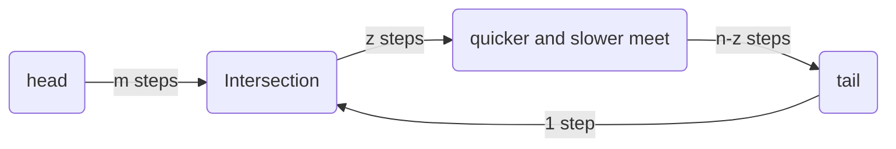

# Explanation

[Problem Description](https://leetcode.com/problems/linked-list-cycle-ii/)

We can use a hash set to store the traversed nodes, and when traversing along the link, check whether the current node appears in the hash set. If yes, there is a loop. Refer to [Solution 1](#solution-1) for details.

[Solution 1](#solution-1) costs a space complexity of $O(n)$, but if $O(1)$ is required, there still is a way below.

Assume there is a loop in the linked list. So we could run along with the linked list with two runners of different speeds. The quicker one runs two steps for each pace, while the slower one runs one step for each pace. 

When they meet up, the quicker one runs `m + (n + 1) * N + z` steps, where `N` is an integer greater than or equal to 1. The other variables refer to those labels in the following chart. The slower one runs `m + z` steps. Also the quicker one's speed double the slower's, we have

$$
  m + (n + 1) * N + z = 2 (m + z)
$$

So we have 

$$
  m = (n + 1) * N - z
$$

The above equation meas that two equally-speeded runners, among which one starts from `head`, the other starts from `where the previous quicker and slower meet up`, start to run simultaneously, and after `m steps`, they will meet up at the `Intersection` point.

According to the above analysis, [Solution 2](#solution-2) could be derived.



# Solution

## Solution 1

```python
# Definition for singly-linked list.
# class ListNode:
#     def __init__(self, x):
#         self.val = x
#         self.next = None

class Solution:
    def detectCycle(self, head: Optional[ListNode]) -> Optional[ListNode]:
        if head is None or head.next is None: return None
        traveled = set()
        while head:
            if head in traveled: return head
            traveled.add(head)
            head = head.next
        return None
```

## complexity

- time: $O(n)$
- space: $O(n)$

## Solution 2

```python
# Definition for singly-linked list.
# class ListNode:
#     def __init__(self, x):
#         self.val = x
#         self.next = None

class Solution:
    def detectCycle(self, head: Optional[ListNode]) -> Optional[ListNode]:
        if head is None or head.next is None: return None
        slow = fast = head
        while fast and fast.next:
            fast = fast.next.next
            slow = slow.next
            if fast == slow: break
        else:
            return None
        while head != slow:
            head = head.next
            slow = slow.next
        return head
```

## complexity

- time: $O(n)$
- space: $O(1)$